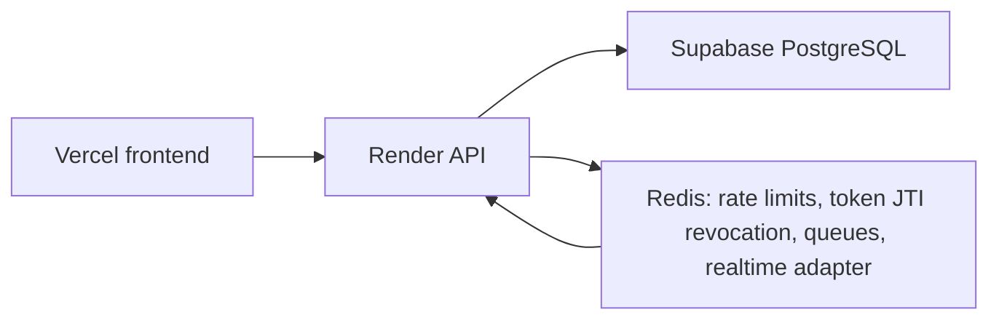

# TriLearn

[](https://github.com/armancore/TriLearn/actions/workflows/ci.yml)
[](LICENSE)


TriLearn is a self-hosted college management system for semester-based institutions.
It combines admissions, role-based academic operations, QR attendance, marks publishing, assignments, notices, real-time notifications, and a student-focused mobile app in one deployable platform.

## Live demo

Live app: [trilearn-arman.vercel.app](https://trilearn-arman.vercel.app/)

Portfolio: [armankhan.com.np](https://www.armankhan.com.np)

TriLearn uses production auth with JWT rotation, Redis-backed rate limiting, and RBAC across admin, coordinator, instructor, gatekeeper, and student workflows.




## Overview

| Area | Highlights |
| --- | --- |
| Product scope | Admissions, enrollment, attendance, marks, assignments, study materials, notices, notifications, digital ID, and audit logs |
| Interfaces | Express API, React admin/staff web app, Expo student mobile app |
| Realtime | Socket.IO live updates, Redis adapter, BullMQ notification jobs, Firebase FCM push |
| Security | JWT access tokens, rotating refresh tokens, Redis JTI revocation, Helmet, Zod validation, role-based authorization |
| Storage | PostgreSQL records, local or S3/R2-compatible uploads, protected file serving |
| API endpoints | 107 |
| DB models | 23 |
| Test lines | 9000+ |

## Full stack inventory

| Layer | Technology |
| --- | --- |
| Runtime and API | Node.js, Express 5, OpenAPI / Swagger |
| Database and ORM | PostgreSQL 16, Prisma 7, Prisma pg adapter |
| Realtime and jobs | Socket.IO 4, Socket.IO Redis adapter, Redis 7, BullMQ 5 |
| Validation and security | Zod 4, Helmet 8, BCryptJS, jsonwebtoken |
| Files and media | AWS SDK S3/R2, Sharp, PDFKit, pdf-lib, ExcelJS |
| Email and push | Nodemailer, Resend SMTP, Firebase FCM |
| Observability | Winston logging, health checks, audit records |
| Web app | React 19, Vite 8, Tailwind CSS 4, React Router 7, Framer Motion 12 |
| Mobile app | Expo SDK 55, Expo Router 4, NativeWind 4, Zustand 5, TanStack Query 5, expo-secure-store, expo-camera |
| Deployment | Docker Compose, production migrations, Redis-backed scaling paths |

## What TriLearn does

TriLearn manages the student lifecycle from first intake through semester enrollment and daily academic work.
Students can apply or be imported in bulk, coordinators review the intake queue, approved students receive accounts, and the institution assigns them to batches, semesters, sections, subjects, and instructors.
The system is built around semester-based operations rather than a generic contact database.

After enrollment, TriLearn handles the routine work of a college department: QR attendance for class sessions and gate entry, manual attendance corrections, absence tickets, marks entry, marks publishing, assignments, PDF submissions, study materials, class routine, and notices.
Students and staff receive real-time notifications for events that need attention, including approvals, published marks, assigned work, notices, and attendance-related updates.

TriLearn is self-hostable.
The institution runs the application on its own infrastructure, owns the database and uploaded files, and does not depend on per-seat licensing fees.
PostgreSQL stores institutional records, Redis supports short-lived coordination and revocation state, and uploads can be kept on local disk for a single server or moved to S3-compatible storage for production scaling.

The system is intended for institutions that need role-based control without outsourcing core academic data to a hosted SaaS vendor.
It gives staff a shared operational system for admission-related intake, teaching work, attendance records, and student-facing academic information.
The web app is suitable for administrative and teaching workflows, while the mobile app covers student and scan-heavy usage where a phone is the natural device.

## Roles

### Admin

The admin role has institution-wide visibility and control.
Admins manage users, roles, departments, batches, semesters, subjects, sections, academic configuration, notice audiences, audit records, and operational settings.
They can review system-wide activity, correct administrative data, and oversee security-sensitive actions such as account lifecycle management and rate-limit policy behavior.
Admins are also the role most likely to prepare a new academic cycle.
That includes creating the structures that coordinators and instructors later use, checking that migrations and environment settings are correct, and reviewing audit activity when something unusual happens.
The role is intentionally broad because it owns platform governance, not only classroom workflow.
Admin access should be assigned sparingly.
Most day-to-day academic work belongs to coordinators and instructors.
Keeping admin access limited reduces the chance that ordinary academic operations accidentally become unrestricted system administration.

### Coordinator

The coordinator role runs academic operations for assigned programs or departments.
Coordinators review student intake, approve eligible students, manage enrollment details, assign instructors, publish marks, supervise attendance records, post scoped notices, and resolve academic workflow issues that span more than one class.
They see the records needed to coordinate students, instructors, subjects, sections, and semester activity without receiving unrestricted platform administration access.
Coordinators are the bridge between institutional setup and day-to-day teaching.
They can clean up intake mistakes, make sure a student is placed in the right academic group, and decide when draft academic records are ready for student visibility.
Their permissions are practical for department operations while still keeping infrastructure-level controls with admins.
This role is also where many cross-class decisions become explicit.
A coordinator can compare records across sections, check whether an instructor-facing update is ready, and make release decisions that should not be left to an individual student or gate workflow.
That gives the institution a controlled review layer between raw classroom activity and official student-facing records.

### Instructor

The instructor role focuses on teaching activity for assigned subjects and sections.
Instructors can take QR or manual attendance, upload study materials, create assignments, review submissions, enter marks, request or prepare marks for publishing, and receive notifications tied to their classes.
They see the students, attendance records, submissions, materials, and marks relevant to their own teaching workload.
The instructor view is scoped around current teaching responsibility.
An instructor should not need to search through unrelated programs to run a class, upload a file, or check who submitted work.
That scope keeps common teaching workflows direct and keeps unrelated student records out of normal instructor access.
Instructor permissions follow assignment rather than global role title alone.
An instructor's access should be meaningful only where the institution has assigned teaching responsibility.
This helps the same system support multiple departments, programs, or semesters without exposing every class to every instructor.

### Gatekeeper

The gatekeeper role manages entry attendance at the institution gate.
Gatekeepers scan signed student ID QR codes, record gate attendance, validate active student identity, and see only the operational information needed for entry checks.
This keeps gate operations fast while limiting exposure to academic records that are not needed at the gate.
Gatekeepers work with a narrow, high-frequency workflow.
They need fast verification, clear scan outcomes, and enough context to identify whether a card belongs to an active student.
They do not need marks, assignments, notices, or other academic data to do that job.
The gatekeeper workflow is deliberately simple because delays at entry points affect many students at once.
The scan result should answer whether the student credential is valid and whether the gate event can be recorded.
Anything beyond that belongs in academic or administrative screens.

### Student

The student role gives each approved learner access to their own academic record and active semester work.
Students can view routine, notices, attendance, study materials, assignments, submissions, marks after publication, their digital ID card, and notifications.
They can submit assignment PDFs, raise absence tickets where allowed, and use the mobile app for the workflows that benefit from phone access.
Student access is personal rather than administrative.
A student sees the record that affects their own enrollment, attendance, submissions, and academic results.
The same account can move through semesters while preserving continuity in notifications, ID usage, and historical records.
Students do not publish official academic data themselves.
They interact with records that staff have created, approved, or released.
That distinction keeps the student interface useful without turning it into an administrative console.

## Key features

### Student intake and bulk import

TriLearn supports reviewed student intake instead of assuming every submitted record should immediately become an active account.
Students can enter the intake flow individually, and staff can import larger groups when a semester or batch is being prepared.
The approval step gives coordinators a place to verify identity, program, batch, semester, and section data before account activation.
When a student account is created, TriLearn auto-generates a unique temporary password for that student and requires the password to be changed on first sign-in.

Bulk import is designed for institutional onboarding work where the source data often comes from spreadsheets.
The backend validates imported rows before they become durable records and keeps the enrollment process tied to the same role and audit controls as manual intake.
This makes initial setup and new-semester onboarding faster without bypassing approval discipline.

The intake workflow also creates a clean boundary between candidate data and active student records.
That boundary is useful when an application is incomplete, a row in an import file is malformed, or a coordinator needs to reject or defer a student before account creation.
TriLearn keeps those decisions visible instead of hiding them in a one-step import script.
The same intake model supports gradual rollout.
An institution can begin with one program or batch, validate the workflow, and then expand imports as data quality improves.
Because approvals and account creation are separate, staff can correct source data before it becomes part of the active academic record.

### QR attendance for subject and gate

TriLearn has two QR attendance paths because classroom attendance and gate attendance answer different questions.
Subject QR attendance records whether a student attended a specific academic session.
Gate QR attendance records whether the student entered through an institutional checkpoint.

Signed QR payloads prevent clients from fabricating attendance data by guessing identifiers.
The server verifies the QR signature, checks the student context, applies timing and role rules, and writes attendance through controlled endpoints.
The result is a faster attendance process that still leaves an auditable server-side record.

The subject and gate paths can evolve independently.
A classroom scan can be tied to a subject, section, and session timing rule, while a gate scan can focus on identity and entry status.
That separation avoids forcing one attendance model to carry two different institutional meanings.
QR attendance still depends on server-side authority.
The QR payload is only a signed input to the backend, not the attendance record itself.
The accepted attendance record is created only after the backend verifies the signature, user context, and relevant timing or role conditions.

### Manual attendance

Manual attendance exists for cases where QR scanning is unavailable, a device fails, a class needs correction, or a coordinator approves a later update.
Instructors and coordinators can record or adjust attendance through role-protected workflows instead of editing database rows directly.

The manual path is intentionally separate from QR scanning.
That separation lets the system apply different validation, audit, and rate-limit rules for human-entered corrections.
It also helps reviewers distinguish normal scan-based attendance from later operational changes.

Manual attendance is not treated as a backdoor around QR rules.
It exists because real classrooms have late arrivals, network outages, device issues, and approved corrections.
The system records those changes through authenticated staff actions so later review can tell how the final attendance state was reached.
This also helps when attendance data is used downstream.
If a report, absence ticket, or student view reflects a manual correction, the institution can distinguish that correction from an original scan event.
That context matters when resolving disputes.

### Absence tickets

Absence tickets give students and staff a structured way to handle disputed or explainable absences.
A student can raise a ticket for an absence according to institutional rules, and the responsible academic staff can review it with the surrounding attendance context.

This keeps attendance corrections out of informal messages.
The ticket record captures who raised the issue, what attendance event it relates to, how it was resolved, and which role performed the review.
Notifications keep the affected users informed as the ticket moves through the workflow.

The ticket workflow gives coordinators and instructors a better review surface than a scattered message thread.
They can see the attendance date, student identity, stated reason, and decision state in one place.
When a ticket changes state, the student does not need to poll a staff member for the outcome.
Absence tickets are intentionally connected to attendance data rather than being free-form support requests.
That keeps the review focused on the affected class or date.
It also gives staff enough context to resolve the issue without manually reconstructing the attendance history.

### Marks and publish flow with marksheet PDF

Marks entry and marks publication are separate operations.
Instructors can enter marks for their assigned subjects, while coordinators or authorized staff control when marks become visible to students.
This prevents draft marks from leaking into student views before academic review is complete.

After publication, students can see their marks through the web or mobile interface.
TriLearn can also generate marksheet PDFs so students and staff have a portable academic record for the published result.
The PDF output is generated from server-side data rather than client screenshots, which keeps the marksheet tied to the authoritative record.

The publish flow protects both students and instructors.
Instructors can work on marks before they are final, and students only see results after the institution has decided they are ready.
That distinction is important in colleges where marks may need verification, moderation, or coordinator approval before release.
Generated marksheets should reflect only published data.
That prevents a downloaded PDF from becoming a record of draft values.
It also means a later audit can tie the document back to the release state of the marks workflow.

### Assignments and PDF submissions

Instructors can create assignments for the classes they teach, attach requirements, set expectations, and receive submissions from enrolled students.
Students submit PDFs through the application, and the backend validates file type and size according to role-specific upload policy.

PDF submissions are treated as controlled uploads rather than arbitrary static files.
The server validates the content, stores it through the configured upload backend, and serves it only through authenticated routes where the requester is allowed to access that assignment.
This keeps student work connected to enrollment and role checks.

Assignment records keep submission status visible to both sides of the workflow.
Students can confirm that a file has been submitted, and instructors can review submissions from the class context instead of handling files through email or chat.
The server remains the source of truth for submission timing and file access.
The upload model keeps file handling consistent with the rest of the system.
Assignment submissions are not just files on disk.
They are academic records with ownership, timing, access rules, and review state.

### Study materials with enrollment-gated file serving

Study materials are uploaded by authorized academic staff and served only to users who should be able to access them.
The system checks enrollment, subject, section, and role context before returning protected files.

This design matters because uploaded materials often contain course-specific documents that should not be public.
TriLearn can store files locally for a single-server setup or in S3-compatible storage for production.
In both cases, access decisions stay in the application layer instead of relying on public file URLs.

Enrollment-gated serving also keeps old links from becoming uncontrolled distribution points.
A user must still be authenticated and authorized when requesting the file.
That means storage choice can change without changing the access model seen by students and instructors.
This is especially useful when a course continues across multiple weeks.
Students can return to the same material list from the web or mobile app, and the backend can keep enforcing the current enrollment state on every request.
The file URL alone is not enough to bypass that check.

### Class routine with conflict detection

The routine module manages scheduled classes across semesters, sections, subjects, instructors, and rooms or time slots.
When a routine entry is created or changed, TriLearn checks for conflicts that would make the schedule impossible to run.

Conflict detection helps catch overlapping instructor assignments, section clashes, and timing mistakes before students and instructors see the schedule.
The routine then becomes the shared source for daily class planning in the web and mobile interfaces.
Notifications can alert affected users when schedule changes matter to them.

Routine data is more than a timetable display.
It is also context for attendance, instructor workload, and student expectations for a day.
Detecting conflicts at write time reduces the number of corrections that have to be explained after students have already followed a wrong schedule.
The routine also gives mobile users a predictable daily view.
Students can check where they should be, and instructors can check what they are responsible for.
When a coordinator changes the routine, the update can flow through the same notification system used by other academic events.

### Notice board with audience scoping

The notice board lets staff publish announcements to the right audience instead of broadcasting every message to everyone.
Notices can be scoped by role, academic grouping, or institutional audience depending on the workflow.

Audience scoping keeps the notice board useful as volume grows.
Students see messages relevant to their academic context, instructors see operational updates tied to their work, and coordinators or admins can still publish broader institutional notices when needed.
Real-time notification delivery helps new notices reach active users quickly.

Scoped notices also reduce notification fatigue.
An institution can send a notice to a batch, semester, role, or wider audience without making every user filter irrelevant announcements manually.
The notice record remains available after the real-time notification has been delivered.
This makes notices useful for both immediate and later reference.
A user who was offline when the notice was created can still find it in the notice board.
The socket event improves delivery speed but does not replace the durable notice record.

### Real-time notifications via Socket.IO

TriLearn uses Socket.IO for live notification delivery across web and mobile clients.
When a meaningful academic or administrative event happens, the backend creates a notification and emits it to the users who should receive it.

Redis is used as the Socket.IO adapter in production so multiple backend instances can share events.
If Redis is not available in a local development setup, the server can fall back to in-memory behavior for a single process.
BullMQ handles queued notification work with retry and backoff so transient delivery problems do not immediately drop work.

The live channel is used for immediacy, not as the only durable record.
Important notification events are stored or queued by the backend before being emitted.
That lets a disconnected client recover by fetching notifications later instead of depending on a socket connection that may not have been open.
The notification model supports multiple delivery surfaces.
The same backend event can appear in the web app, mobile app, and push-related workflows when configured.
That keeps notification rules centralized instead of duplicating them per client.

### Digital student ID card with signed QR

Each active student can use a digital ID card with a signed QR payload.
The QR code is intended for controlled verification workflows such as gate attendance and identity checks.

The signature prevents a client from creating a trusted ID payload by editing visible student data.
The backend verifies the signature and the student state before accepting scans.
This lets the ID card work as a practical mobile credential while keeping trust anchored on server-side signing secrets.

Signed QR identity also makes the gate workflow simpler for staff.
The scanner can send the payload to the backend and receive a clear accept or reject response.
The gatekeeper does not need to interpret hidden fields or manually compare academic records during a busy entry period.
Signing also allows key rotation when configured with active key identifiers.
That gives deployments a path to replace QR signing material without redesigning the card flow.
Old signatures can be phased out according to institutional policy.

### Audit log

TriLearn records security-sensitive and operationally important actions in the audit log.
The audit trail helps administrators understand who changed a record, which workflow produced an event, and when an important decision happened.

Audit logging is especially important for attendance corrections, account lifecycle events, approval decisions, upload actions, and other records that affect students.
Retention and cleanup settings keep the log bounded while preserving enough history for review.

The audit log is not meant to replace application data.
It explains sensitive changes around that data.
When a coordinator publishes marks, an admin changes a user role, or an attendance correction is made, the audit record gives the institution a way to reconstruct the decision path.
Audit records are most useful when they are generated consistently by the application.
Direct database edits bypass that context.
Production operations should therefore favor application workflows and migrations over manual table changes.

### Role-based rate limiting

Rate limiting is applied with awareness of authentication and role context.
Login, upload, QR, Socket.IO, and other sensitive routes can be limited differently based on the risk and expected usage pattern.

Redis-backed rate limits are required for reliable production behavior across multiple backend instances.
The local development configuration can be relaxed when needed, but production settings should keep abuse controls active.
This protects expensive endpoints and security-sensitive flows without treating every user action as identical.

Role-based limits also reflect normal usage differences.
A gatekeeper scanning many students at entry time has a different pattern from a student logging in or uploading a PDF.
TriLearn can protect the platform while still allowing legitimate high-volume operational flows.
This matters during peak periods.
Login attempts, gate scans, assignment uploads, and socket events may all spike at different times of day.
Role-aware limits let the backend apply pressure where abuse is likely without blocking normal institutional traffic.

## Architecture

### Request lifecycle

Requests pass through a layered Express middleware chain before controller logic runs.
The normal path is CORS, Helmet, rate limit, CSRF, protect, allowRoles, validate, and then the controller.

CORS limits which browser origins can call the API.
Helmet sets common HTTP security headers.
Rate limiting slows abusive or accidental request bursts before they hit expensive handlers.
CSRF protection applies where cookie-backed browser behavior needs additional protection.

The protect middleware verifies authentication and attaches the current user context.
allowRoles checks whether that authenticated user can perform the requested action.
validate applies request schema checks before the controller performs the business operation.
Controllers then work with already-authenticated, authorized, and validated input.

The order matters because each step should reject bad requests as early as possible.
Origin and header policy run before role-specific business logic.
Rate limits run before expensive controller work.
Validation runs before database writes.

Controllers should not need to rediscover basic request safety.
Their job is to execute the domain action with the user context and validated data they receive from the middleware chain.
That keeps route behavior easier to test because authorization and validation are not scattered through unrelated controller branches.

### Auth flow

TriLearn uses short-lived JWT access tokens and rotating refresh tokens.
The access token is kept in client memory and is used for normal API authorization.
The refresh token is stored in an httpOnly cookie and is used only to obtain a new access token.

Access tokens expire after 15 minutes by default.
Refresh tokens expire after 7 days by default and rotate when used.
Each refresh token carries a JTI so the server can revoke or detect specific token instances through Redis.

When a user changes their password, passwordChangedAt invalidation prevents older tokens from continuing to authorize requests.
Refresh token reuse detection treats a reused old refresh token as suspicious because rotation should have replaced it.
That protects sessions when a refresh token has leaked or when a client tries to replay a stale token.

The client-side access token is intentionally short lived.
Keeping it in memory reduces the value of persistent browser storage compromise.
The refresh cookie is protected by browser cookie controls and is not used as the bearer credential for ordinary API calls.

Redis JTI state gives the backend a practical way to revoke token instances without waiting for natural expiry.
That is useful during logout, password changes, suspicious reuse detection, and administrative account intervention.
In production, losing Redis means losing part of the session safety model, so Redis should not be treated as optional.

### File uploads

Uploads enter the backend through multer memoryStorage.
Keeping the upload in memory during validation lets the server inspect the file before it is written to durable storage.
The backend performs magic-byte validation rather than trusting the filename or browser-provided MIME type.

Images and PDFs are processed through libraries such as sharp and pdf-lib where the workflow requires transformation, normalization, or safe document generation.
After validation and processing, files are stored in S3-compatible object storage when S3 settings are configured.
If S3 is not configured, the backend falls back to local disk storage for single-server development or simple deployments.

Serving protected files still goes through the application.
The server checks role and enrollment rules before returning study materials, assignment submissions, marksheets, or other controlled files.
This avoids turning private academic content into public static assets.

Memory-based upload handling is paired with strict size limits.
The system should reject oversized files before they create memory pressure, and role-based limits let the institution allow larger instructor or coordinator uploads without giving the same limit to every student submission.
Magic-byte validation helps catch renamed files that pretend to be PDFs or images.

S3 is the right production target when more than one backend instance can serve traffic.
Local disk fallback keeps development simple and supports small single-server deployments.
The application layer hides that storage difference from clients, so the API contract remains stable when storage moves.

### Real-time

Socket.IO handles real-time delivery for web and mobile clients.
Clients connect to the backend socket endpoint after authentication and receive events for notices, approvals, assignment activity, published marks, attendance updates, and other notification-backed workflows.

In production, Socket.IO uses the Redis adapter so events can move across more than one backend instance.
If Redis is not present in a local single-process setup, real-time delivery can fall back to in-memory behavior.
That fallback is useful for development but is not a production substitute.

BullMQ powers the notification queue.
Queued jobs can retry with backoff when transient failures happen, which is important for email, push, and socket-related side effects.
Redis is the shared queue backend and should be treated as required infrastructure in production.

Socket connections are transient by nature.
A browser tab may sleep, a phone may move between networks, and a user may open more than one device.
The backend should therefore treat socket emission as delivery acceleration while keeping notification state available through normal API reads.

The Redis adapter is what lets horizontal scaling work.
Without it, a user connected to one backend instance would not receive events emitted by another instance.
For a production deployment with multiple replicas, the adapter is part of the real-time architecture rather than an optimization.

### Mobile

The mobile app uses Expo Router for file-based routing.
Screens live in the app directory and follow the route structure expected by Expo Router, while shared client code lives under mobile source modules.

State and session handling use Zustand and SecureStore.
Zustand keeps app state predictable without making every screen manage its own session copy.
SecureStore holds sensitive persisted values that should survive app restarts but should not sit in plain AsyncStorage.

API calls use Axios with an interceptor that refreshes expired access tokens.
The refresh path is deduped so multiple simultaneous 401 responses do not trigger a refresh storm.
TanStack Query manages server-state caching and refetch behavior for mobile screens that depend on API data.

The mobile environment variables must point to addresses the device can actually reach.
Localhost works for the development machine but not for most physical phones.
During local testing on a phone, EXPO_PUBLIC_API_URL and EXPO_PUBLIC_SOCKET_URL usually need the computer's LAN IP address.

The mobile app shares the same authorization model as the web client.
It does not get a separate privileged API path.
That keeps backend permissions consistent across devices and makes mobile behavior testable against the same endpoints.

## API versioning

- The API is versioned at the URL level: `/api/v1/...`
- Breaking changes (removed fields, changed response shapes, auth changes) require a bump to `/api/v2`. Non-breaking additions do not.
- The mobile app sends `X-Client-Version` and `X-App-Version` headers on every request. When a version is too old, the backend returns HTTP `426 Upgrade Required` and the mobile app clears the session and prompts the user to update.
- v1 will be supported for a minimum of 12 months after v2 is released.
- Internal-only changes (new endpoints, added optional fields) do not require a version bump.

## Project structure

```text
TriLearn/
├── backend/
│   ├── prisma/
│   │   ├── migrations/
│   │   └── schema.prisma
│   ├── src/
│   ├── test/
│   ├── uploads/
│   ├── .env.example
│   ├── Dockerfile
│   └── package.json
├── frontend/
│   ├── public/
│   ├── src/
│   ├── test/
│   ├── .env.example
│   ├── index.html
│   ├── vite.config.js
│   └── package.json
├── mobile/
│   ├── app/
│   ├── assets/
│   ├── src/
│   ├── .env.example
│   ├── app.json
│   └── package.json
├── docker-compose.yml
├── DEPLOYMENT.md
└── README.md
```

## Getting started

TriLearn requires Node.js 20 or newer, PostgreSQL 16, and Redis 7.
Use PostgreSQL for the Prisma database and Redis for revocation, queues, rate limits, and real-time coordination.
For local development, each layer can run in its own terminal.
Start the backend first so the frontend and mobile clients have an API to call.
Then start the web client or Expo app depending on the interface being developed.
When using a physical phone, replace localhost mobile URLs with the development machine's LAN address.

### Backend setup

```bash
git clone <repo-url>
cd TriLearn/backend
cp .env.example .env
npm install
npm run prisma:migrate:dev
npm run dev
```

The backend command starts the Express API and Socket.IO server.
Prisma migrations create the local schema expected by the application.
Redis should be available before exercising refresh token revocation, rate limiting, notification queues, or multi-process real-time behavior.

### Frontend setup

```bash
cd TriLearn/frontend
cp .env.example .env
npm install
npm run dev
```

The frontend Vite server reads VITE_API_URL from frontend/.env.
Use the API path form, such as http://localhost:5000/api/v1, so the frontend API helper can route requests consistently.
The same backend origin is also used for live notification connections.

### Mobile setup

```bash
cd TriLearn/mobile
cp .env.example .env
npm install
npx expo start
```

The Expo app reads public runtime configuration from mobile/.env.
For Android emulators, the API host may need to be http://10.0.2.2:5000 instead of localhost.
For physical devices, use the LAN IP of the machine running the backend.

### Docker Compose shortcut

```bash
cd TriLearn
cp .env.example .env
cp backend/.env.example backend/.env
docker compose up
```

The Compose file starts PostgreSQL, Redis, and the backend service.
It does not replace the separate frontend and mobile development servers.
Use it when you want the core backend dependencies and API to start together on a single development machine.
For production Docker Compose deployments, use `docker compose -f docker-compose.prod.yml up -d --build`.

## Environment variables

### Backend environment variables

| Variable | Required | Description |
| --- | --- | --- |
| DATABASE_URL | Yes | PostgreSQL connection string used by Prisma and the PostgreSQL adapter. |
| JWT_ACCESS_SECRET | Yes | Secret used to sign short-lived access tokens. |
| JWT_REFRESH_SECRET | Yes | Secret used to sign rotating refresh tokens. |
| QR_SIGNING_SECRET | Yes | Secret used to sign digital student ID and attendance QR payloads. |
| LOGIN_CAPTCHA_SECRET | Yes | Secret used to sign login captcha challenges. |
| FRONTEND_URL | Yes | Trusted frontend origin for CORS, password reset links, and browser Socket.IO connections. |
| NODE_ENV | Yes | Runtime mode, normally development, test, or production. |
| REDIS_URL | Production | Redis connection string for JTI revocation, rate limits, Socket.IO scaling, and BullMQ. |
| S3_BUCKET | Optional | S3-compatible bucket for upload storage; local disk is used when S3 settings are incomplete. |
| S3_REGION | Optional | Region for S3-compatible upload storage. |
| S3_ACCESS_KEY | Optional | Access key for S3-compatible upload storage. |
| S3_SECRET_KEY | Optional | Secret key for S3-compatible upload storage. |
| MAIL_FROM | Optional | Sender address for password reset and notification email. |
| RESEND_SMTP_HOST | Optional | SMTP host for Resend or compatible SMTP delivery, normally smtp.resend.com. |
| RESEND_SMTP_PORT | Optional | SMTP port for Resend or compatible SMTP delivery, normally 587. |
| RESEND_SMTP_USER | Optional | SMTP user for Resend or compatible SMTP delivery. |
| RESEND_SMTP_PASS | Optional | SMTP password for Resend or compatible SMTP delivery. |
| BCRYPT_ROUNDS | Yes | Bcrypt cost factor for password hashing. |
| ACCESS_TOKEN_EXPIRES_IN | Yes | Access token lifetime, usually 15m. |
| REFRESH_TOKEN_EXPIRES_DAYS | Yes | Refresh token lifetime in days, usually 7. |
| ENABLE_PASSWORD_RESET | Optional | Enables password reset email flow when SMTP settings are present. |
| FORCE_HTTPS | Production | Requires HTTPS-aware behavior when the API is deployed behind a reverse proxy. |
| UPLOAD_DIR | Optional | Local upload directory used when S3 storage is not configured. |
| FCM_SERVER_KEY | Optional | Firebase Cloud Messaging server key for mobile push notifications. |

Use port 587 with STARTTLS (RESEND_SMTP_SECURE=false). Use port 465 only for legacy SSL.

### Frontend environment variables

| Variable | Required | Description |
| --- | --- | --- |
| VITE_API_URL | Yes | Browser API base URL, normally http://localhost:5000/api/v1 in local development. |

### Mobile environment variables

| Variable | Required | Description |
| --- | --- | --- |
| EXPO_PUBLIC_API_URL | Yes | Mobile API base URL; physical devices need a reachable LAN or deployed HTTPS address. |
| EXPO_PUBLIC_SOCKET_URL | Yes | Mobile Socket.IO origin; it should point to the same backend host without the API path. |

## Running tests

Run backend tests from the backend directory.

```bash
node --test test/*.test.js
```

The backend has more than 9000 lines of tests covering authentication, upload security, rate limiting, QR signing, and integration behavior.
These tests are the most important verification layer for security-sensitive API changes.
They should be run before changing auth, middleware, upload handling, QR validation, attendance, marks publishing, or role permissions.
Database-backed integration tests may require a reachable PostgreSQL instance and a test-safe DATABASE_URL.

Run frontend tests from the frontend directory.

```bash
vitest run
```

Run mobile tests from the mobile directory.

```bash
jest
```

Frontend and mobile tests focus on client behavior and rendering-level expectations.
They are useful companions to the backend test suite, but they do not replace API authorization and data-integrity coverage.
When a change crosses layers, run the relevant tests in each affected directory.

## Deployment

Production deployments should set NODE_ENV=production and use strong secrets for every signing and password-related setting.
Run prisma migrate deploy before starting the backend so the database schema matches the application code.
When the API is behind a reverse proxy, set FORCE_HTTPS=true and configure the proxy to forward the expected HTTPS and host headers.

Redis is required in production.
It backs distributed rate limits, the Socket.IO adapter, BullMQ notification jobs, and refresh-token JTI revocation.
Running without Redis should be treated as a local development fallback only.

Use S3-compatible storage for uploads when running more than one backend instance.
Local disk upload storage is acceptable for development and simple single-server deployments, but it does not give multiple application instances a shared file backend.
Docker Compose can run PostgreSQL, Redis, and the backend for a single-server deployment path.

A production reverse proxy should terminate TLS, forward the original protocol and host headers, and only expose the ports that are meant to be public.
The backend should receive trusted proxy configuration that matches the actual deployment topology.
Do not rely on development defaults for cookies, rate limits, or error output in production.

Backups should include PostgreSQL and any configured upload storage.
Redis contains important live coordination and revocation state, but PostgreSQL and uploads are the durable institutional records.
Plan restore procedures before the system is used for real academic data.

See [DEPLOYMENT.md](DEPLOYMENT.md) for full deployment details.

## Author

Arman Khan

Portfolio: [armankhan.com.np](https://armankhan.com.np)

GitHub: [armancore](https://github.com/armancore)

## Licence

TriLearn is open source under the [ISC License](LICENSE).
